# Ancient Library 📚

A comprehensive digital scripture management system that allows users to organize, manage, and discover religious texts through AI-powered verse suggestions. Built with modern web technologies and machine learning capabilities.

## 🌟 Features

### Core Functionality
- **Scripture Management**: Create, edit, and organize religious scriptures
- **Chapter Organization**: Structure logical chapters
- **Verse Management**: Manage individual verses with multilingual support
- **Media Integration**: Attach video and audio files to verses
- **Bulk Import**: Upload verses via CSV or JSON files
- **Secure Authentication**: JWT token-based user authentication

### 🤖 AI-Powered Verse Prediction
The main highlight of the application is the intelligent verse suggestion system:

- **Keyword-Based Search**: Users can select from predefined keywords or add custom ones
- **Advanced ML Models**: 
  - **KeyBERT**: For automatic keyword extraction from text
  - **all-MiniLM-L6-v2**: Pre-trained sentence transformer for semantic similarity
- **Smart Suggestions**: Get relevant verse recommendations based on keyword context
- **Semantic Understanding**: AI understands the meaning behind keywords, not just exact matches

## 🚀 Technology Stack

### Backend
- **Framework**: Node.js/Express.js or Python/FastAPI
- **Database**: MongoDB/PostgreSQL
- **Authentication**: JWT (JSON Web Tokens)
- **File Processing**: CSV/JSON parsers
- **ML Libraries**: 
  - KeyBERT for keyword extraction
  - Sentence Transformers (all-MiniLM-L6-v2)

### Frontend
- **Framework**: React.js
- **Styling**: CSS
- **Media Player**: Custom audio/video components

## 📱 User Interface

The application includes the following key screens:

## 🖼️ UI Showcase

### Application Screenshots

#### Home Dashboard
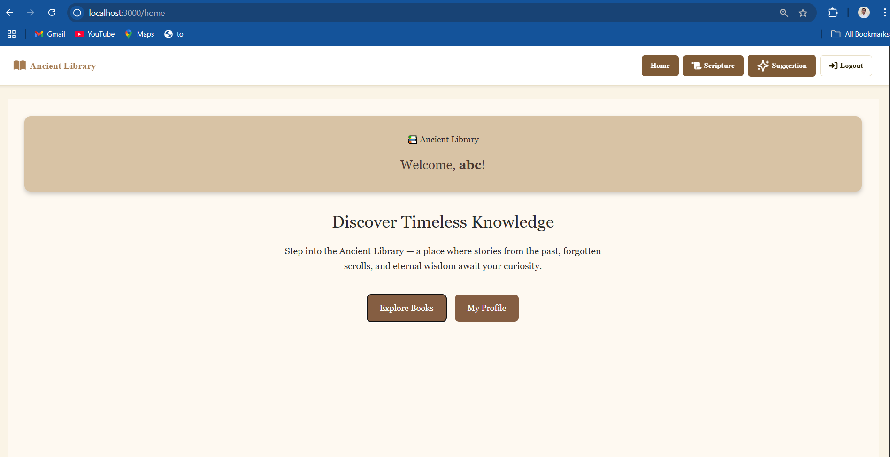
*Main dashboard with quick access to all features and recent activity*

#### Authentication
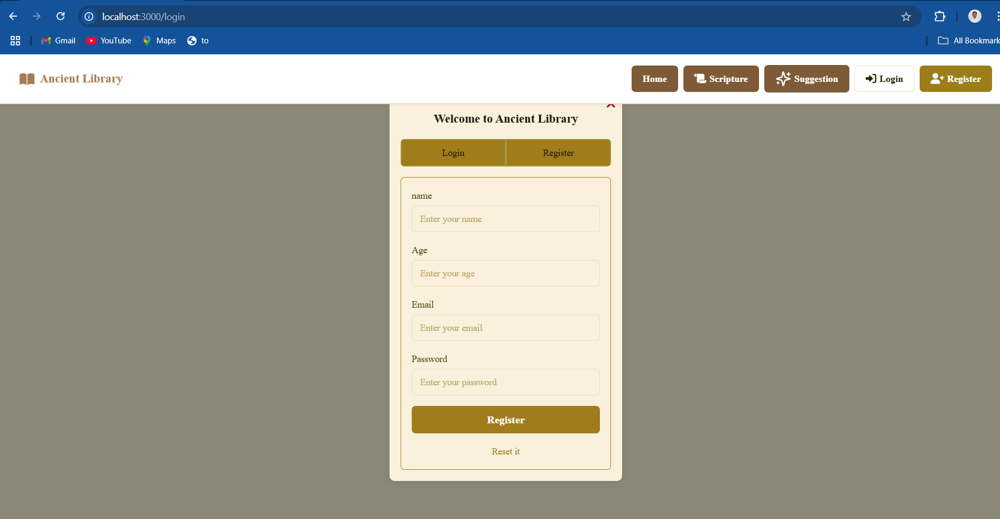
*Secure login interface with JWT token authentication*

#### Scripture Management
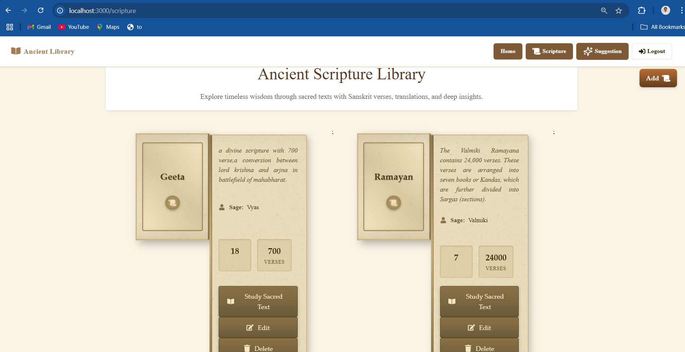
*Browse and manage all available scriptures*

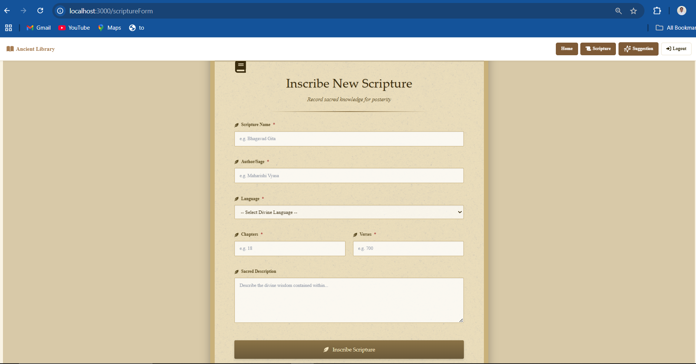
*Create and edit scripture details*

#### Chapter Organization
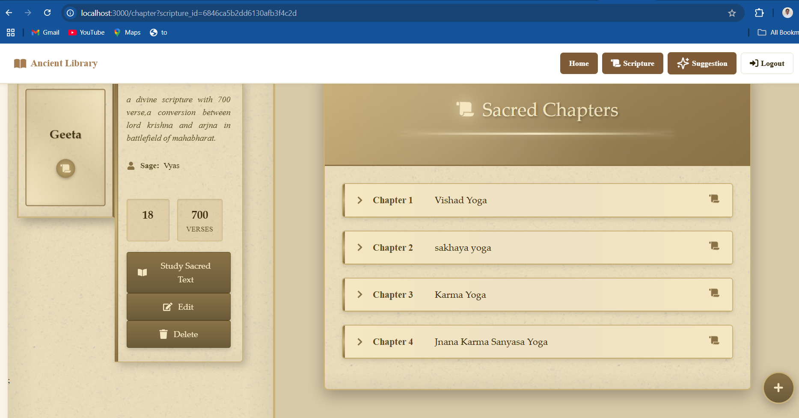
*View all chapters within a selected scripture*

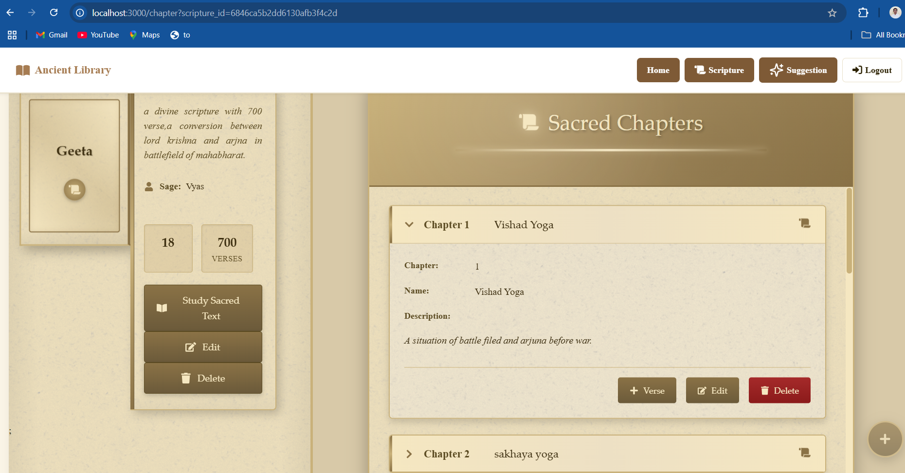
*Detailed chapter view with verse listings*

#### Verse Management
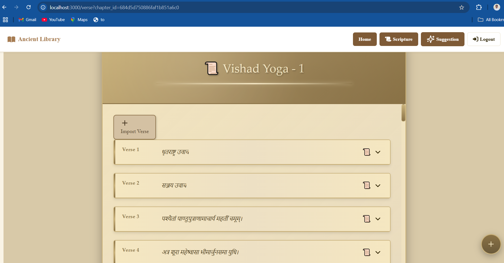
*Individual verse management interface*

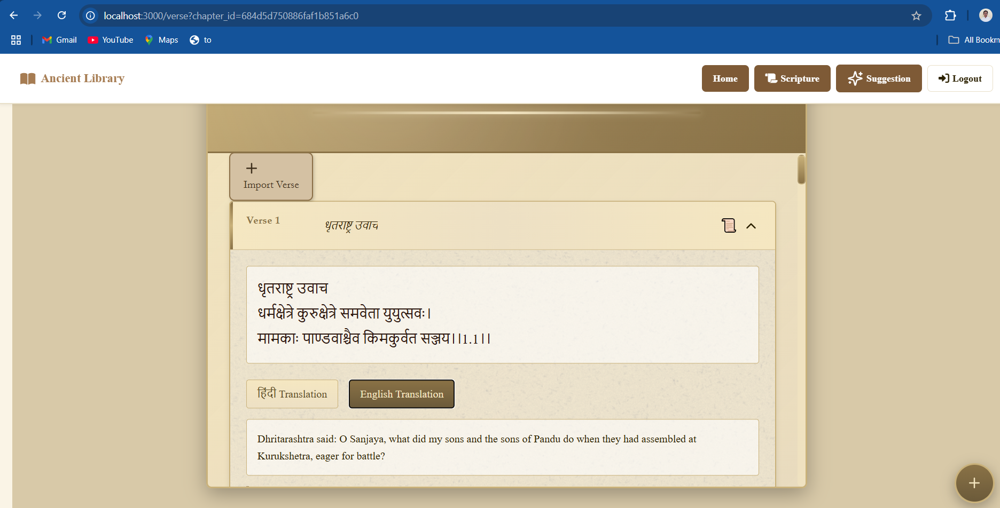
*Full verse display with Hindi and English translations*

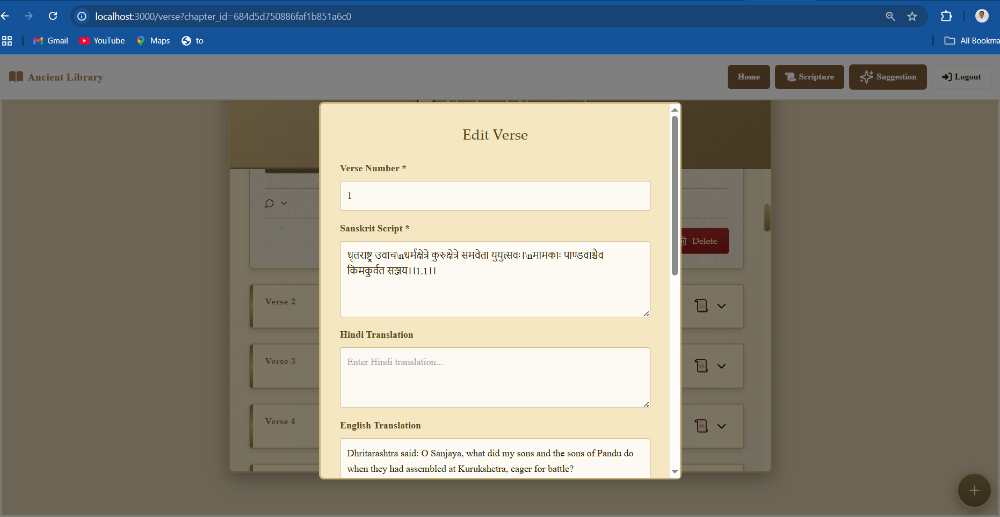
*Add and edit verse information*

#### Data Import & Media
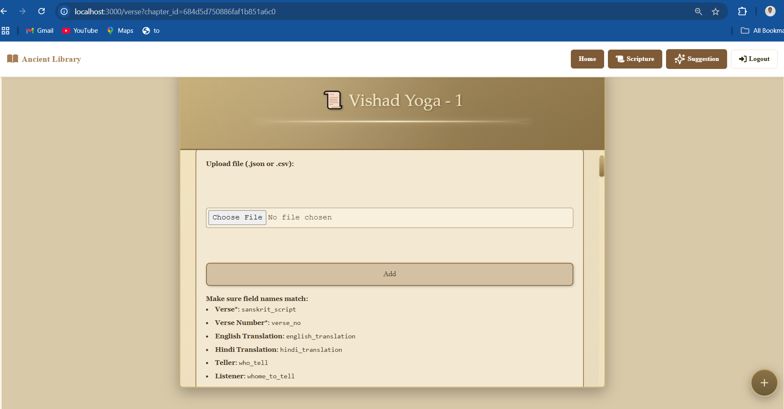
*Bulk import verses from CSV/JSON files*

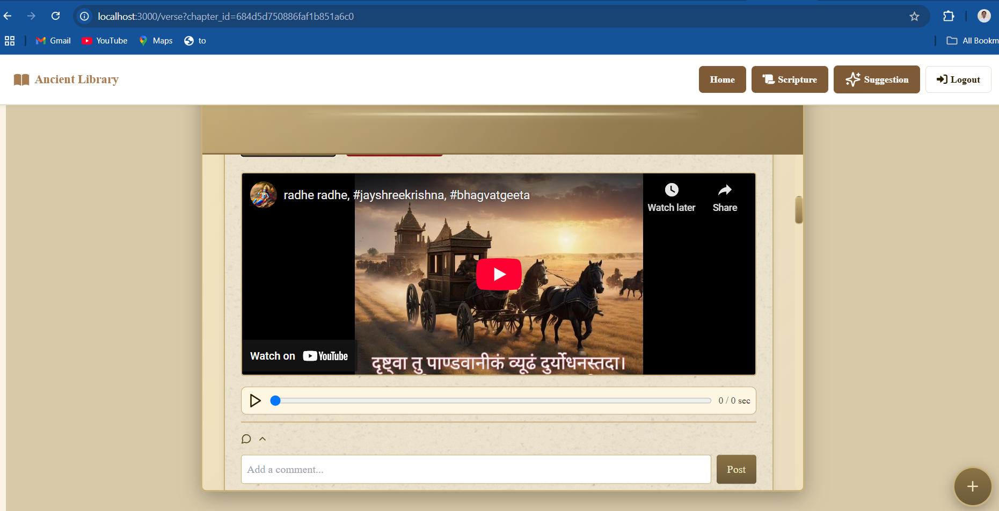
*Media management for verse audio and video content*

#### 🤖 AI Prediction System
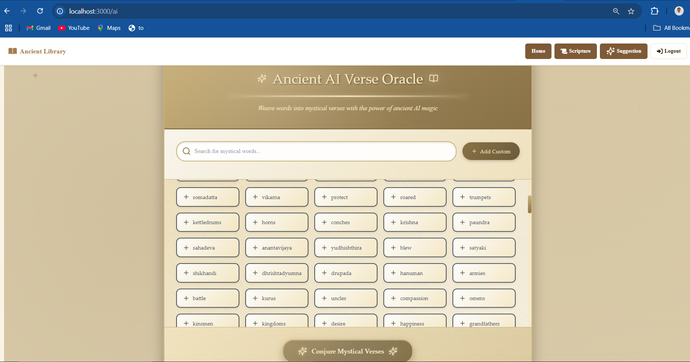
*Main AI-powered verse prediction dashboard*

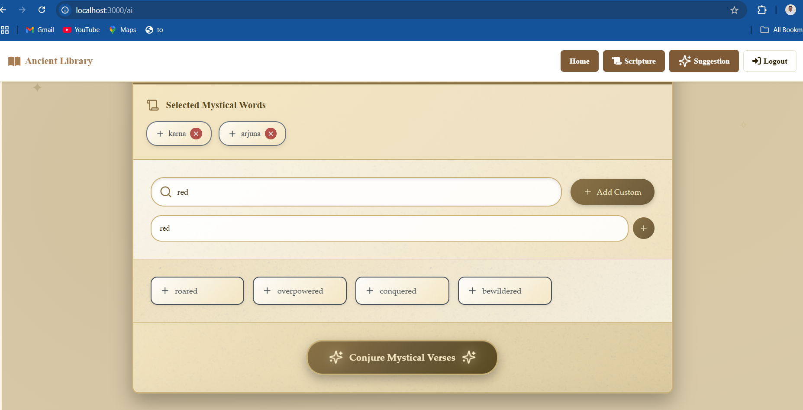
*Keyword selection interface for AI predictions using KeyBERT and all-MiniLM-L6-v2*

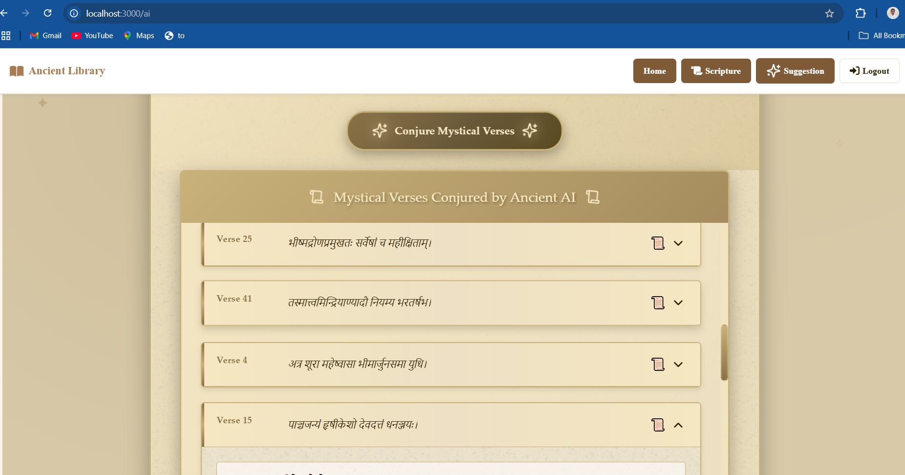
*AI-powered verse recommendations*

## 🧠 AI Prediction System

### How It Works

1. **Keyword Selection**: Users choose from predefined keywords or add custom ones
2. **Text Processing**: KeyBERT extracts meaningful keywords from the query
3. **Embedding Generation**: all-MiniLM-L6-v2 creates semantic embeddings
4. **Similarity Matching**: System finds verses with similar semantic meaning
5. **Ranked Results**: Verses are ranked by relevance and presented to the user

## 🔐 Authentication

The application uses JWT tokens for secure authentication:

- **Registration**: Users create accounts with email/username
- **Login**: Secure login with encrypted passwords
- **Token Management**: Automatic token refresh and logout
- **Protected Routes**: All scripture management requires authentication

## 🎯 Key Features Deep Dive
### 1. Media Integration
- Upload audio recordings of verse recitations
- Video (youtube video link) explanations and commentaries

## 🤝 Contributing

1. Fork the repository
2. Create a feature branch (`git checkout -b feature/amazing-feature`)
3. Commit your changes (`git commit -m 'Add amazing feature'`)
4. Push to the branch (`git push origin feature/amazing-feature`)
5. Open a Pull Request

## 🔮 Future Enhancements

- **Multi-language Support**: Add Sanskrit, hindi
- **Advanced Search**: Fuzzy search and phonetic matching
- **Social Features**: User comments and verse sharing
- **Mobile App**: React Native or Flutter mobile application
- **Voice Search**: Audio keyword input for predictions
- **Bookmark System**: Save favorite verses and predictions
- **Analytics Dashboard**: Usage statistics and popular verses

## 🙏 Acknowledgments

- **KeyBERT**: For powerful keyword extraction capabilities
- **Sentence Transformers**: For semantic similarity models
- **Hugging Face**: For pre-trained model hosting
- **Community Contributors**: For scripture data and translations

---

**Ancient Library** - Bridging ancient wisdom with modern technology through AI-powered scripture discovery.
